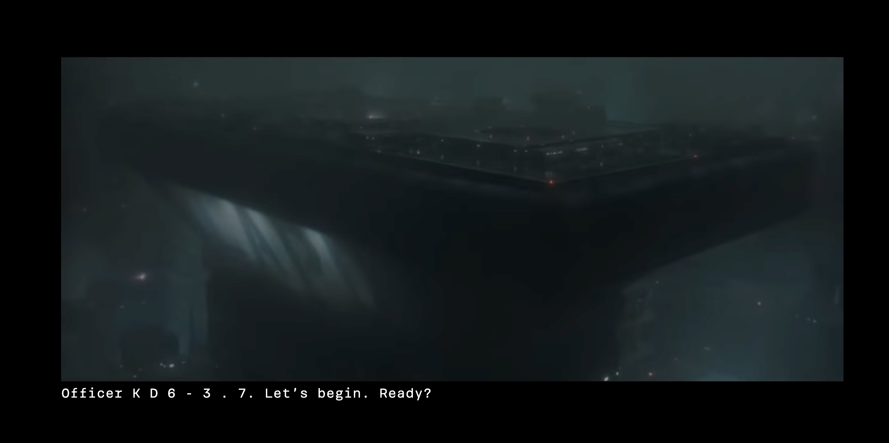
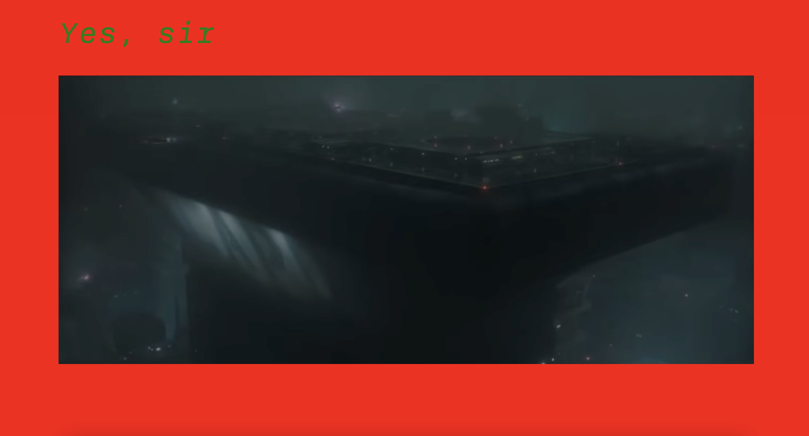

# Web Typography, 2020/2021
Ik kreeg de opdracht om voor een doof persoon een fragment uit de film 'Bladerunner 2019' te bewerken zodat een doof persoon de spanning van de film ook voelt. Toen ik deze opdracht kreeg raakte ik al snel in paniek, want ik heb al een tijdje niet met HTML en CSS gewerkt. Het is ook zeker niet mijn sterkste punt, vaak als dingen mislukken heb ik geen motivatie meer om verder te gaan. Voor mij was dit dus zeker een uitdaging, omdat we ook maar twee weken plus vakantie hadden om dit vak af te ronden.

# Mijn ideeën die ik wel/niet heb uitgeprobeerd
Mijn idee was om het fragment vrij simpel te houden, puur omdat mijn skills niet al te goed zijn en omdat ik het anders te druk vind worden voor een doof persoon, die doet puur alles op zicht en als er teveel onzin op het scherm getoond word was het naar mijn idee veel te vol.

Ik begon om naar de gehele code te kijken en te onderzoeken. Wat is wat en wat doet iets? Ik kwam er eerst niet uit maar na wat vragen en Google kwam ik er al gauw achter wat wat was.

Ik kwam op de JaveScript van sounds terecht en kreeg al snel goede ideeën, namelijk als de sound afgespeeld wordt dat de achtergrond kleur veranderd. Eerst was de achtergrond wit, en die pastte ik snel aan naar zwart omdat dat al gelijk er wat spannender uit ziet. Het leek mij leuk om na het eerste geluid (het alarm) de achtergrond naar rood te veranderen. Dat zag er zo uit:

Ik vond het effect er al heel cool uit zien, maar niet het effect wat ik wilde maken. Na een voortgangsgesprek kwam ik erachter dat ik graag een box-shadow wilde toevoegen, omdat dat er heel vet uit zag. Alleen had ik geen idee hoe dat exact te werk ging, dus ging ik thuis vanalles proberen totdat ik er gek van werd. Daarna heb ik uiteindelijk rondgevraagd en kwam ik op de volgende box shadow:

Ik vond deze box-shadow al veel beter maar nog lang niet goed, na feedback tijdens de voortgangsgesprekken kwam ik er ook achter dat ik het opvallender wilde, dus daar heb ik voor het eindresultaat ook voor gekozen:

Op de screenshot is het niet duidelijk te zien, maar de box-shadow is wat donker roder en wordt veel groter ten opzichte van de vorige box shadow. Dit heb ik bij verschillende andere box-shadows ook toegepast met een kleine twist, namelijk de box shadow eerst blauw maken en de seconde erna wat groter en dan wit. Eerst had ik alleen gekozen voor de kleur blauw maar met twee verschillende kleuren vond ik het er cooler uit zien. Deze sounds zijn 3 keer achter elkaar te horen, bij de eerste en de laatste sound is het van blauw naar wit en in de middelste sound is het van wit naar blauw, puur voor wat afwisseling. 
Deze box-shadow had ik om te testen groen gemaakt, maar dat vond ik uiteindelijk helemaal geen bijpassende kleur dus vond ik blauw wel een mooi alarm geluid.
Hier wat voorbeelden:

Ik was zo verslaafd geraakt aan de box-shadows dat ik besloot om de body ook een box-shadow te geven nadat ik dat had gezien bij andere medestudenten. Ik heb dat bij het politie alarm geluid toegepast, daar had ik eerst alleen een blauwe box-shadow om de video container en nu ook een rode box-shadow op de body. Dat ziet er zo uit:

Toen was de uitdaging er om de vervelende pieptoon vorm te geven. Ik begon met het scherm te laten trillen, met een animatie. Gelukkig is er genoeg te vinden op internet over animaties dus dat heeft me zeker geholpen. Ik heb een 'shake' aangemaakt en het beeld laten trillen (een screenshot maken daarvan is lastig ;) ) Ook liet ik een box-shadow om de video-container steeds groter worden. Ik vond het nog niet irritant genoeg, dus ik was diep aan het denken wat nog meer pijn kan doen aan je ogen. 

Omdat ik toch al bezig was met de box-shadow op de body probeerde ik dat ook uit bij de pieptoon. Zodat de box-shadow van de video-container en van de body 1 geheel worden. Dat vond ik er cool uit zien maar nog niet irritant genoeg. 

Na wat feedback van medestudenten wist ik dat dit nog niet irritant genoeg was, ik wilde eigenlijk het beeld laten draaien maar ik kwam er niet uit, dus toen dacht ik aan het beeld snel in en uit laten zoomen, en dan steeds sneller zodat het gewoon echt pijn doet aan je ogen. Ik begon eerst met 1 animatie die ik had gevonden op internet en het leek als ergens op, nu nog sneller. Na nog wat extra's sounds in de Java te zetten kwam ik uiteindelijk op 3 animaties voor het in en uitzoomen van de video. Dit duurde ontzettend lang en ik heb er zelf ook pijn van gekregen in mijn ogen ;)

